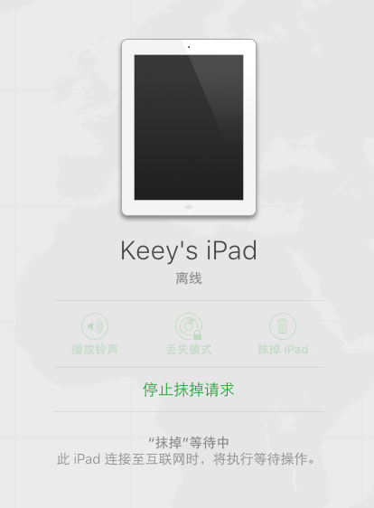

# Apple ID 被盗，该做些什么

## 简介

由于本人太过大意，无视了苹果给我发的 *`Web浏览器上登陆iCloud`* 的安全提醒，导致 `Apple ID` 被篡改，账户无法再登陆、部分苹果设备无法正常使用，在此记录一下我找回 `Apple ID` 的经历。

避免像我一样，酿成如此惨剧，大家一定要开启[两步验证](https://support.apple.com/zh-cn/HT204152)和[双重验证](https://support.apple.com/zh-cn/HT204915)

## 收到可疑邮件

  

如收到类似上图的邮件，并且你从未使用过 Windows 系统登陆 iCloud，请马上修改 `Apple ID` 的密码，若未开启[两步验证](https://support.apple.com/zh-cn/HT204152)和[双重验证](https://support.apple.com/zh-cn/HT204915)，请立即开启。

## 正文开始

1. 断开所有苹果设备的网络，包括你有登陆被盗帐号的所有 `iPhone` `iPad` `Mac` `iPod Touch`。Mac 可以直接注销 `iCloud` 登陆，无需验证密码。
2. 第一时间[联系 Apple 支持](https://getsupport.apple.com/)或者拨打苹果客服电话(`400-666-8800`)
3. 联系了客服后，她会帮你查看帐号是否开启丢失模式
  1. 如果还没有，她接下来会问记不记得安全提示问题的答案
    1. 如果不记得，她会让你提供 任意一台绑定帐号的苹果设备 的相关购买凭证（发票或者电子收据）、包装盒子、三包卡。然后就等吧。
    2. 如果记得的话，回答正确就能够顺利拿回帐号，然后赶紧修改密码，并且开启[两步验证](https://support.apple.com/zh-cn/HT204152)和[双重验证](https://support.apple.com/zh-cn/HT204915)。
  2. 如果不幸被开启丢失模式，那么客服会进一步让你提供勒索邮件的截图、关于本机的全部截图。然后就等消息吧。

## 我自己实际情况

  

当时我是收到了这封邮件之后，觉得很奇怪，马上就[联系 Apple 支持](https://getsupport.apple.com/)。才知道原来帐号被盗了，然后客服就提醒我要断开所有苹果设备的网络，并且把 Mac 的 iCloud 注销掉。可是不幸的是，我把安全提示问题的答案给忘了，只能走提交凭证的流程。还好我的手机是在苹果官网上下单买的，什么材料都齐全。接下来客服就告诉我得等四个工作日才有结果，那有什么办法，只好等咯。。

到了第二天，发现凌晨收到了勒索邮件，大概意思就是叫我交钱，才把帐号还给我。当时我去查了网上资料，发现大多数人还是交钱了事，费用在`600-1200`这个范围，但是我不想便宜了这个犯罪团伙，所以我报警了。没想到广州的警察这么给力，我打110报案之后马上就有人上门服务了，听警察叔叔讲，他们是第一次接到 `Apple ID 被盗` 的报案！！！由于还没有金钱上的损失，只是到派出所备个案而已。

到了晚上，苹果客服打电话给我了，说我的帐号被开启丢失模式，得进一步提交一些凭证才可以继续走流程。随后我就提交了我的报警回执、勒索邮件、关于本机的截图。接下来又是漫长的等待了。。。

等了三个礼拜，终于有消息了，我的帐号回...来...了...因为我手机当时只是断网了，所有数据都还在的，，在那之前我也好久没有备份手机了，只是不知道手机现在直接联网会不会有什么问题。所以我上去了 iCloud 的网页版上去看，果真还是有这个抹掉请求。

  

我停掉了抹掉请求，然后带着忐忑不安的情绪尝试了联网。。。。。然后手机上提示我输入登陆密码，我紧接着输入了新设置的密码，然后就什么事情都没有发生，真是太好了。

其实我收到帐号解锁的邮件时，也是马上联系了苹果客服。然后这个客服好像都不知道 `iCloud` 上可以这么操作，一直在跟我强调，手机联网后就会恢复到刚买回来的样子，也就是从 Hello 界面开始。幸好我发现了这个方法可以避免数据丢失，在此分享给大家，拿到帐号后请务必先去 `iCloud` 停掉抹掉请求。

## 相关资料

* https://www.zhihu.com/question/35044212/answer/95774861
* https://www.v2ex.com/t/229482
